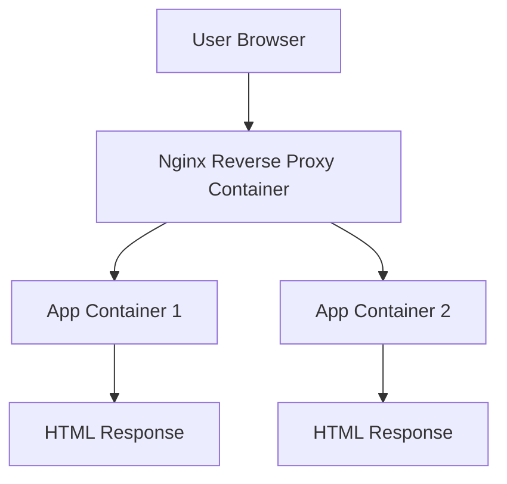

# 🚀 Docker Nginx Reverse Proxy Load Balancer


---

# 📌 Project Overview

This project demonstrates how to build a **containerized load balancing architecture using Docker and Nginx**.

The system includes:

- 🐳 Multiple **Application Containers**
- ⚖️ **Nginx Reverse Proxy Load Balancer**
- 🌐 **Docker Networking**
- ☁️ Deployment on **AWS EC2**

The **Nginx proxy container distributes incoming traffic between multiple backend containers using Round Robin load balancing**.

---

# 🎯 Project Objectives

✔ Deploy multiple application containers  
✔ Configure Docker networking  
✔ Implement Nginx reverse proxy  
✔ Enable load balancing  
✔ Deploy on cloud infrastructure  

---

# 🏗 System Architecture

```
                🌍 Internet
                      │
                      ▼
             +-------------------+
             |   Nginx Proxy     |
             |  Load Balancer    |
             |     Port 80       |
             +-------------------+
                │           │
                ▼           ▼
           +---------+ +---------+
           |  App1   | |  App2   |
           | Nginx   | | Nginx   |
           | Server  | | Server  |
           +---------+ +---------+
```

---

# 📊 Mermaid Architecture Diagram



---

# ⚙️ Technologies Used

| Technology | Purpose |
|------------|--------|
| Docker | Containerization |
| Nginx | Reverse Proxy & Load Balancer |
| AWS EC2 | Cloud Infrastructure |
| Linux | Server Operating System |

---

# 📂 Project Structure

```
docker-nginx-loadbalancer/

├── README.md
```

In this project we use **default Nginx configuration inside the container**, so no external configuration files are required.

---

# 🧰 Prerequisites

Before starting ensure you have:

✔ Linux server (AWS EC2 recommended)  
✔ Docker installed  
✔ Port **80 open in Security Group**  
✔ Basic Docker knowledge  

---

# 🐳 Install Docker

```bash
sudo apt update
sudo apt install docker.io -y
```

Start Docker:

```bash
sudo systemctl start docker
sudo systemctl enable docker
```

Verify installation:

```bash
docker --version
```

---

# ⚙️ Implementation Steps

This project uses the **default Nginx configuration available in the Docker image**.

Instead of creating custom configuration files, we:

- Use **default.conf inside the container**
- Create **custom index.html pages inside containers**
- Configure **Nginx reverse proxy for load balancing**

---

# 🌐 Step 1 — Create Docker Network

Create a custom Docker network.

```bash
docker network create app-network
```

Verify:

```bash
docker network ls
```

---

# 📦 Step 2 — Run Application Container 1

```bash
docker run -d \
--name app1 \
--network app-network \
nginx
```

---

# 📦 Step 3 — Run Application Container 2

```bash
docker run -d \
--name app2 \
--network app-network \
nginx
```

Verify containers:

```bash
docker ps
```

---

# 📝 Step 4 — Create Custom HTML Pages

Default Nginx web directory:

```
/usr/share/nginx/html
```

---

# 🖥 Step 5 — Modify Page in Container 1

Access container:

```bash
docker exec -it app1 bash
```

Navigate to directory:

```bash
cd /usr/share/nginx/html
```

Edit page:

```bash
nano index.html
```

Add:

```
<h1>This is from the App1 containerr</h1>
```

Save and exit.

---

# 🖥 Step 6 — Modify Page in Container 2

Access container:

```bash
docker exec -it app2 bash
```

Navigate to directory:

```bash
cd /usr/share/nginx/html
```

Edit file:

```bash
nano index.html
```

Add:

```
<h1>This is from the App2 container</h1>
```

Save and exit.

---

# ⚖️ Step 7 — Run Proxy Server Container

```bash
docker run -d \
--name proxy-server \
--network app-network \
-p 80:80 \
nginx
```

---

# ⚙️ Step 8 — Configure Reverse Proxy

Access proxy container:

```bash
docker exec -it proxy-server bash
```

Open default configuration:

```bash
nano /etc/nginx/conf.d/default.conf
```

Update configuration:

```nginx
upstream webserver {
    server app1:80;
    server app2:80;
}

```
Open default configuration:

```bash
nano /etc/nginx/nginx.conf
```
Update configuration:

```nginx

    location / {
        proxy_pass http://webserver;
    }
}
```
Reload Nginx:

```bash
nginx -s reload
```

---

# 🌍 Access the Application

Open browser:

```
http://YOUR-EC2-PUBLIC-IP
```

Refresh multiple times to observe **load balancing**.

Example responses:

```
Response from APP1 Container
Response from APP2 Container
```

---

# 🧪 Testing Using Curl

```bash
curl localhost
```

Run multiple times to observe container switching.

---

# 🔄 Load Balancing Method

Nginx uses **Round Robin** by default.

Example:

```
Request 1 → APP1
Request 2 → APP2
Request 3 → APP1
Request 4 → APP2
```

---

# 📈 Benefits of This Architecture

✔ High availability  
✔ Horizontal scalability  
✔ Traffic distribution  
✔ Microservice-ready architecture  

---

# 🧠 DevOps Concepts Demonstrated

- Docker container networking
- Reverse proxy architecture
- Nginx load balancing
- Containerized applications
- Cloud deployment

---

# 🎓 Interview Questions From This Project

1️⃣ What is a Reverse Proxy?  
2️⃣ How does Nginx Load Balancing work?  
3️⃣ What is Docker Networking?  
4️⃣ Difference between Bridge Network and Host Network?  
5️⃣ What is the purpose of upstream servers in Nginx?

---

# 🚀 Future Improvements

You can extend this project by adding:

- Docker Compose
- HTTPS using Let's Encrypt
- Kubernetes deployment
- CI/CD pipeline with Jenkins
- Monitoring with Prometheus

---

# 👨‍💻 Author

**Prasad Bhoite**

Aspiring **Cloud & DevOps Engineer**

## 📩 Connect With Me :-

If you’d like to collaborate, discuss projects, or just say hello — feel free to reach out!  

### 🔗 Social & Professional Links
- 🌐 [Portfolio Website](https://prasad-bhoite19.github.io/prasad-portfolio/)  
- 💼 [LinkedIn](http://linkedin.com/in/prasad-bhoite-a38a64223)  
- 🐙 [GitHub](https://github.com/Prasad-bhoite19)  
- ✉️ [Email](prasadsb2002@gmail.com)  

💬 Always open for opportunities in **Cloud, DevOps, and Full-Stack Projects**
---

# ⭐ Support

If you found this project helpful:

⭐ Star this repository  
🍴 Fork the project  
📢 Share with the DevOps community  

---
